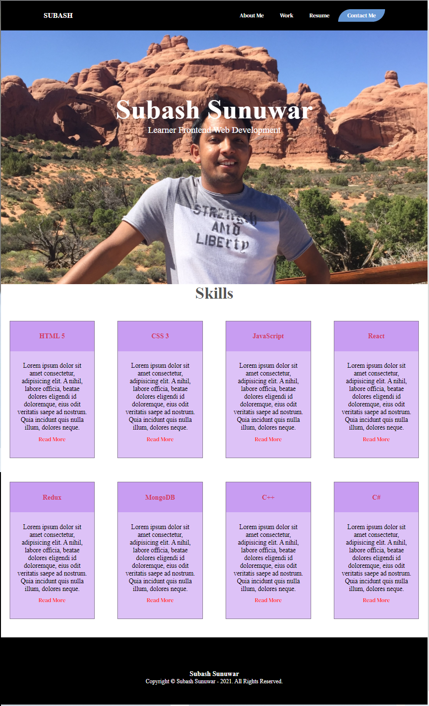

# 02 Advanced CSS: Portfolio

## Introduction

Hello! my name is Subash Sunuwar. This is my portfolio. In this portfolio I used HTML and CSS. I also used a flex-box property to align cards.

This portfolio used plain HTML and CSS, no advanced programming are introduced in here. Portfolio followas a semantic HTML elements and it is accessable for screen reader.

